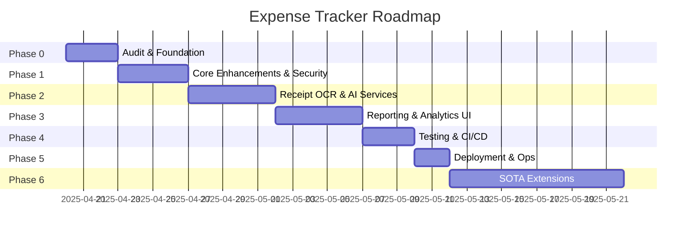

# Expense Tracker Project Roadmap

**Last updated:** 2025-04-20

---

## Purpose
This document outlines the phases, objectives, deliverables, timelines, and status for the Expense Tracker application. It is a living document: update the **Last updated** date, **Status**, and dates as work progresses.

## How to Use
- Update the **Last updated** date at the top whenever you revise this file.
- Modify the **Status** column below as tasks move from `Not Started` → `In Progress` → `Complete`.
- Adjust **Start** and **End** dates to reflect real progress.
- Add new phases or break down existing ones for finer granularity.

## Roadmap Phases

| Phase                                   | Objectives                                                                         | Deliverables                                                             | Timeline (Start → End)       | Status      |
|-----------------------------------------|------------------------------------------------------------------------------------|---------------------------------------------------------------------------|------------------------------|-------------|
| **Phase 0 – Audit & Foundation**        | Code audit, config refactor, factory pattern, blueprint split, DB migrations setup | `config.py`, blueprints, Flask-Migrate scripts                            | 2025-04-20 → 2025-04-22      | In Progress |
| **Phase 1 – Core Enhancements & Security** | Auth, validation, CSRF, error handlers, structured logs                           | `User` model, login/logout, WTForms/Marshmallow schemas, Sentry integration | 2025-04-23 → 2025-04-26      | Not Started |
| **Phase 2 – Receipt OCR & AI Services** | Integrate Vision OCR, receipt parsing service, AI tips interface                  | `services/receipt_parser.py`, `AIService` abstraction                      | 2025-04-27 → 2025-05-01      | Not Started |
| **Phase 3 – Reporting & Analytics UI**  | Interactive charts, budgets & alerts, data export                                  | Chart.js dashboards, budget module, CSV/PDF exports                        | 2025-05-02 → 2025-05-06      | Not Started |
| **Phase 4 – Testing & CI/CD**           | Unit/E2E tests, CI pipeline, Docker setup                                         | pytest suite, GitHub Actions workflows, `Dockerfile`, `docker-compose.yml` | 2025-05-07 → 2025-05-09      | Not Started |
| **Phase 5 – Deployment & Ops**          | Production deployment, monitoring & alerts                                         | AWS ECS/Fargate or GCP Cloud Run configs, Prometheus/Grafana dashboards    | 2025-05-10 → 2025-05-11      | Not Started |
| **Phase 6 – SOTA Extensions**           | Anomaly detection, forecasting, chat bot, PWA                                      | ML pipelines, GPT chat UI, PWA manifest/service workers                   | TBD                          | Not Started |

---

## Dynamic Gantt (Mermaid)

---

## Maintenance & Updates
- **Status values:** `Not Started`, `In Progress`, `Complete`, `Blocked`.
- After completing a deliverable, mark that row as `Complete`, update the actual end date, and bump the **Last updated** date.
- Add or split phases as needed.
- **Review cadence:** update weekly or upon major milestones.
